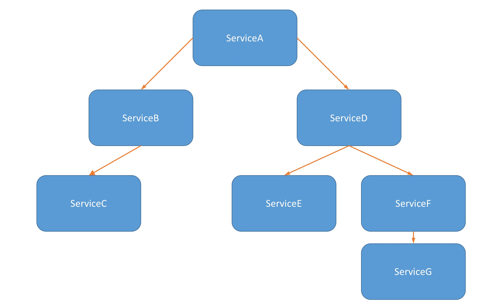

# zipkin-demo

## Zipkin 是一款开源的分布式实时数据追踪系统（Distributed Tracking System），基于 Google Dapper 的论文设计而来，由 Twitter 公司开发贡献。其主要功能是聚集来自各个异构系统的实时监控数据，用来追踪微服务架构下的系统延时问题。  

## quick start
#### 下载zipkin并启动
```shell
wget -O zipkin.jar 'https://search.maven.org/remote_content?g=io.zipkin.java&a=zipkin-server&v=LATEST&c=exec'
java -jar zipkin.jar
```
  
#### 启动项目:  
下载代码后, 依此启动各个zipkin-sample下的application后, 访问http://localhost:9090/start
#### 启动zipkin: 
访问localhost:9411即可查看zipkin的信息
#### 调用关系:  
下图即为service的调用关系

